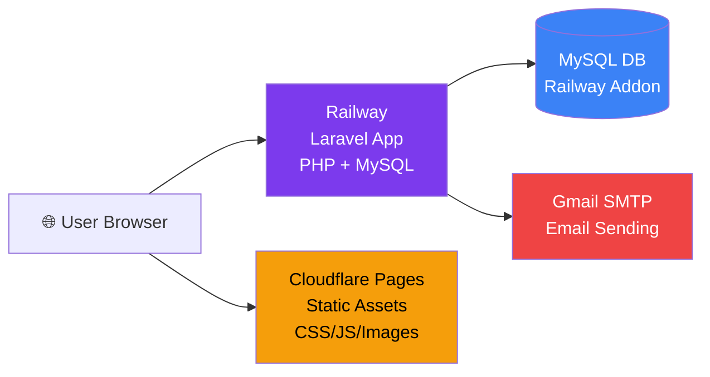

# Jarreva Creative — Railway Deployment Walkthrough

## Summary of Code Changes Made

| File | Change |
|---|---|
| [.env.example](file:///Applications/XAMPP/xamppfiles/htdocs/Jarreva-Creative/.env.example) | Removed leaked APP_KEY and Gmail credentials |
| [AdminSeeder.php](file:///Applications/XAMPP/xamppfiles/htdocs/Jarreva-Creative/database/seeders/AdminSeeder.php) | Passwords now hashed with `Hash::make()` |
| [nixpacks.toml](file:///Applications/XAMPP/xamppfiles/htdocs/Jarreva-Creative/nixpacks.toml) | Added `migrate --force` and `storage:link` to build |
| [app.blade.php](file:///Applications/XAMPP/xamppfiles/htdocs/Jarreva-Creative/resources/views/public/layouts/app.blade.php) | Added SEO meta, Open Graph, Twitter Card, favicon |
| [web.php](file:///Applications/XAMPP/xamppfiles/htdocs/Jarreva-Creative/routes/web.php) | Added `/up` health check endpoint |
| [.env.production.example](file:///Applications/XAMPP/xamppfiles/htdocs/Jarreva-Creative/.env.production.example) | New production env variable template |

> [!NOTE]
> All changes have been committed and pushed to `main` branch on GitHub.

---

## Step-by-Step: Deploy to Railway

### Step 1 — Create Railway Account

1. Buka **https://railway.com** dan klik **"Login"**
2. Login dengan **GitHub account** kamu (`Luqman9-max`)
3. Kamu akan mendapat **$5 free trial credit**

---

### Step 2 — Create New Project

1. Di Railway dashboard, klik **"New Project"**
2. Pilih **"Deploy from GitHub Repo"**
3. Pilih repo **`Luqman9-max/Jarreva-Creative`**
4. Railway akan otomatis detect `nixpacks.toml` dan mulai build

> [!WARNING]
> **Jangan deploy dulu!** Build pertama akan gagal karena belum ada database. Klik **"Cancel Deploy"** jika sudah mulai, lalu lanjut ke Step 3.

---

### Step 3 — Add MySQL Database

1. Di project Railway, klik **"New"** → **"Database"** → **"MySQL"**
2. Railway akan otomatis membuat MySQL instance
3. Klik pada MySQL service → tab **"Variables"**
4. Catat variabel berikut (Railway auto-generates):
   - `MYSQLHOST`
   - `MYSQLPORT`
   - `MYSQLDATABASE`
   - `MYSQLUSER`
   - `MYSQLPASSWORD`

---

### Step 4 — Set Environment Variables

1. Klik pada **Jarreva-Creative service** (bukan MySQL)
2. Buka tab **"Variables"**
3. Klik **"Raw Editor"** dan paste semua variabel berikut:

```env
APP_NAME=Jarreva Creative
APP_ENV=production
APP_KEY=base64:JLohGt/vSXR8PXvJKWAMm1GS0hPew0OEIjr/A+sj71A=
APP_DEBUG=false
APP_URL=https://${{RAILWAY_PUBLIC_DOMAIN}}

DB_CONNECTION=mysql
DB_HOST=${{MySQL.MYSQLHOST}}
DB_PORT=${{MySQL.MYSQLPORT}}
DB_DATABASE=${{MySQL.MYSQLDATABASE}}
DB_USERNAME=${{MySQL.MYSQLUSER}}
DB_PASSWORD=${{MySQL.MYSQLPASSWORD}}

SESSION_DRIVER=database
SESSION_LIFETIME=120
SESSION_ENCRYPT=false
SESSION_SECURE_COOKIE=true
CACHE_STORE=database
QUEUE_CONNECTION=database

LOG_CHANNEL=stack
LOG_STACK=single
LOG_LEVEL=error

MAIL_MAILER=smtp
MAIL_HOST=smtp.gmail.com
MAIL_PORT=465
MAIL_USERNAME=jarrevacreative@gmail.com
MAIL_PASSWORD=ucziyoeioqrqrbml
MAIL_ENCRYPTION=ssl
MAIL_FROM_ADDRESS=jarrevacreative@gmail.com
MAIL_FROM_NAME=Jarreva Creative

BCRYPT_ROUNDS=12
ASSET_CDN_ENABLED=false
ASSET_CDN_URL=
```

> [!IMPORTANT]
> Perhatikan syntax `${{MySQL.MYSQLHOST}}` — ini adalah **Railway reference variables** yang otomatis terisi dari MySQL service. Pastikan nama MySQL service kamu sesuai (default: `MySQL`).

---

### Step 5 — Generate Public Domain

1. Klik pada **Jarreva-Creative service**
2. Buka tab **"Settings"**
3. Scroll ke **"Networking"** → klik **"Generate Domain"**
4. Railway akan memberi domain seperti: `jarreva-creative-production.up.railway.app`
5. **Copy domain ini** — kamu akan butuhkan untuk verifikasi

---

### Step 6 — Deploy

1. Setelah semua variables di-set, Railway akan otomatis trigger deploy
2. Klik tab **"Deployments"** untuk melihat build log
3. Build process akan:
   - ✅ Install PHP 8.3 + extensions
   - ✅ `composer install --no-dev`
   - ✅ `npm ci` + `npm run build`
   - ✅ Cache config, routes, views
   - ✅ Run `migrate --force`
   - ✅ Create `storage:link`
4. Tunggu sampai status **"Success"** (biasanya 2-5 menit)

> [!TIP]
> Jika build gagal, klik pada deployment untuk melihat log error. Masalah umum:
> - **Database connection refused** → pastikan reference variable MySQL benar
> - **npm build failed** → biasanya memory issue, coba lagi

---

### Step 7 — Seed Admin Users

1. Di Railway dashboard, klik pada **Jarreva-Creative service**
2. Buka tab **"Settings"** → scroll ke **"Service"**
3. Atau gunakan **Railway CLI** (opsional):

```bash
# Install Railway CLI
npm install -g @railway/cli

# Login
railway login

# Link project
railway link

# Run seeder
railway run php artisan db:seed --force
```

**Alternatif tanpa CLI:** Tambahkan seeder ke `nixpacks.toml` build phase (sementara):
```toml
# Tambahkan ini di phases.build.cmds (hapus setelah deploy pertama!):
'php artisan db:seed --force'
```

---

### Step 8 — Verify Deployment

Buka URL Railway kamu dan test:

| Test | URL | Expected |
|---|---|---|
| Homepage | `https://your-app.up.railway.app/` | Homepage dengan 3D effects |
| Health Check | `https://your-app.up.railway.app/up` | JSON `{"status":"ok"}` |
| About | `https://your-app.up.railway.app/about` | About page |
| Admin Login | `https://your-app.up.railway.app/admin/login` | Login form |
| Contact | `https://your-app.up.railway.app/contact` | Contact form |

Login admin dengan:
- **Email:** `luqman@jarreva.com`
- **Password:** `luqman`

---

### Step 9 — Build CDN Assets

Di terminal lokal kamu, jalankan:

```bash
cd /Applications/XAMPP/xamppfiles/htdocs/Jarreva-Creative
chmod +x scripts/build-cdn.sh
./scripts/build-cdn.sh
```

Ini akan membuat folder `jarreva-frontend-assets/` di **parent directory** projek.

---

### Step 10 — Create CDN GitHub Repo

```bash
cd /Applications/XAMPP/xamppfiles/htdocs/jarreva-frontend-assets
git init
git add .
git commit -m "Initial CDN assets deployment"
```

1. Buat repo baru di GitHub: **`Luqman9-max/jarreva-frontend-assets`**
2. Push:
```bash
git remote add origin https://github.com/Luqman9-max/jarreva-frontend-assets.git
git branch -M main
git push -u origin main
```

---

### Step 11 — Connect to Cloudflare Pages

1. Buka **https://dash.cloudflare.com** → buat account (gratis)
2. Klik **"Workers & Pages"** → **"Create"** → **"Pages"** → **"Connect to Git"**
3. Pilih repo **`jarreva-frontend-assets`**
4. Settings:
   - **Production branch:** `main`
   - **Build command:** _(kosongkan — assets sudah pre-built)_
   - **Build output directory:** `/` _(root)_
5. Klik **"Save and Deploy"**
6. Cloudflare akan memberi URL seperti: `jarreva-frontend-assets.pages.dev`

---

### Step 12 — Activate CDN in Railway

1. Di Railway dashboard, tambahkan 2 variabel baru:

```env
ASSET_CDN_ENABLED=true
ASSET_CDN_URL=https://jarreva-frontend-assets.pages.dev
```

2. Railway akan auto-redeploy
3. Verifikasi: buka site → inspect element → cek bahwa images/CSS/JS load dari `pages.dev` domain

---

## Architecture After Deployment



---

## Troubleshooting

### Build gagal: "SQLSTATE connection refused"
→ MySQL service belum ready. Tunggu 1-2 menit lalu redeploy.

### Page blank / 500 error
→ Cek `APP_DEBUG=true` sementara di Railway vars untuk melihat error detail. **Jangan lupa kembalikan ke `false`!**

### Images tidak muncul
→ Jalankan `php artisan storage:link` via Railway CLI atau tambah ke nixpacks build.

### Admin login gagal
→ Pastikan sudah run `php artisan db:seed`. Jika sudah tapi tetap gagal, password mungkin belum ter-hash di DB. Jalankan seeder ulang.

### CSS/JS tidak load (404)
→ Pastikan `npm run build` berhasil di build log. Cek bahwa Vite manifest exists.

---

## Monthly Cost Estimate

| Service | Cost |
|---|---|
| Railway (app + MySQL) | ~$5-10/bulan |
| Cloudflare Pages (CDN) | **Gratis** |
| Gmail SMTP | **Gratis** |
| **Total** | **~$5-10/bulan** |

---

## Future Improvements

Setelah deploy berhasil, pertimbangkan:

1. **Custom Domain** — beli domain, arahkan DNS ke Railway
2. **SSL Certificate** — Railway otomatis handle via Let's Encrypt
3. **Redis** — upgrade cache/session dari database ke Redis untuk performa
4. **Backup Database** — setup automated MySQL backup
5. **Monitoring** — tambahkan uptime monitoring (UptimeRobot, gratis)
6. **Stronger Passwords** — ganti password admin ke yang lebih kuat
